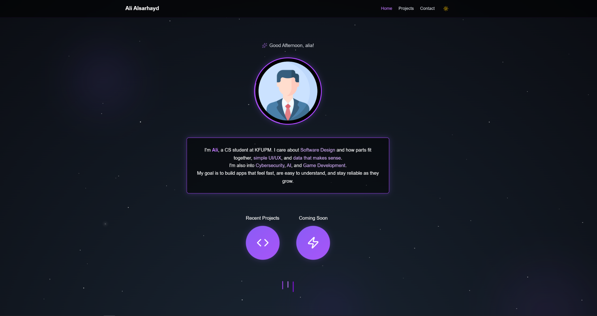
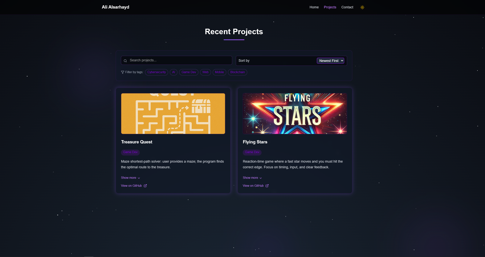
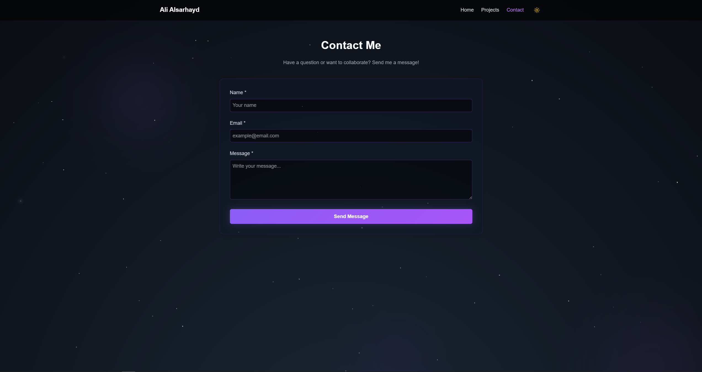

# Personal Portfolio — Vite + React + Tailwind v4

A minimalist developer portfolio with an animated space background (twinkling stars, nebula, shooting stars), a dark/light theme system, and a projects page with search, sort, and tag filters.

## Features

- Animated space background (dark mode only).
- Dark/light theme with localStorage persistence and a small event bus so all pages react instantly.
- Landing page with profile ring, short bio, and quick links to “Recent” and “Coming Soon.”
- Projects page:
  - Search by title/description
  - Sort by date/title
  - Filter by tags (Cybersecurity, AI, Game Dev, Web, Mobile, Blockchain)
  - Data driven from `src/data/projectsData.js`
- Contact page with validation and a success banner; messages stored in `localStorage`.

## Project Structure

vite-project/
  ├─ public/
  ├─ src/
  │  ├─ assets/                # images (profile + project thumbnails)
  │  ├─ components/
  │  │  ├─ projects/
  │  │  │  ├─ ProjectCard.jsx
  │  │  │  └─ ProjectForm.jsx
  │  │  └─ ui/                 # button, input, textarea, badge, select
  │  ├─ data/
  │  │  └─ projectsData.js     # edit your projects here
  │  ├─ pages/
  │  │  ├─ Landing.jsx
  │  │  ├─ Projects.jsx
  │  │  └─ Contact.jsx
  │  ├─ utils/
  │  │  ├─ index.js
  │  │  └─ useTheme.js         # theme subscription hook
  │  ├─ App.jsx
  │  ├─ Layout.jsx             # navbar + background + theme
  │  ├─ index.css              # Tailwind v4 import + globals
  │  └─ main.jsx
  ├─ tailwind.config.js
  ├─ postcss.config.js
  ├─ package.json
  └─ README.md

## Getting Started

### Requirements
- Node.js ≥ 18
- npm (or pnpm/yarn)

### Install
npm install

### Development
npm run dev
Open the URL printed in the terminal (usually http://localhost:5173).

### Production Build
npm run build
npm run preview

## Customization

### Brand / Title
- Navbar brand text: src/Layout.jsx (the <Link> with “Ali Alsarhayd”).
- Document title: index.html (<title>...</title>).

### Profile Photo
- File: src/assets/profile.jpg.
  Replace with your image (same name) or update the path in src/pages/Landing.jsx.

### Projects Data
- Edit src/data/projectsData.js. Each entry has:
  { id, title, description, image_url, date, github_url, tags, category }
- Local images are imported at the top of that file and referenced by variable.

### Categories & Filters
- Supported categories: recent and upcoming
- Access via /projects?category=recent or /projects?category=upcoming
- Tags list is defined where used (ALL_TAGS).

### Theme System
- Stored in localStorage under theme (dark/light).
- Layout.jsx sets data-theme on <body> and broadcasts app-theme-change.
- Components subscribe via useTheme() in src/utils/useTheme.js.

## Accessibility
- Labels for form fields, focusable controls, high-contrast colors in both themes, alt text on images.

## Documentation
- Detailed AI usage: docs/ai-usage-report.md
- Technical notes: docs/technical-documentation.md

## License
MIT

## 🖼️ Project Preview

  

  

  

